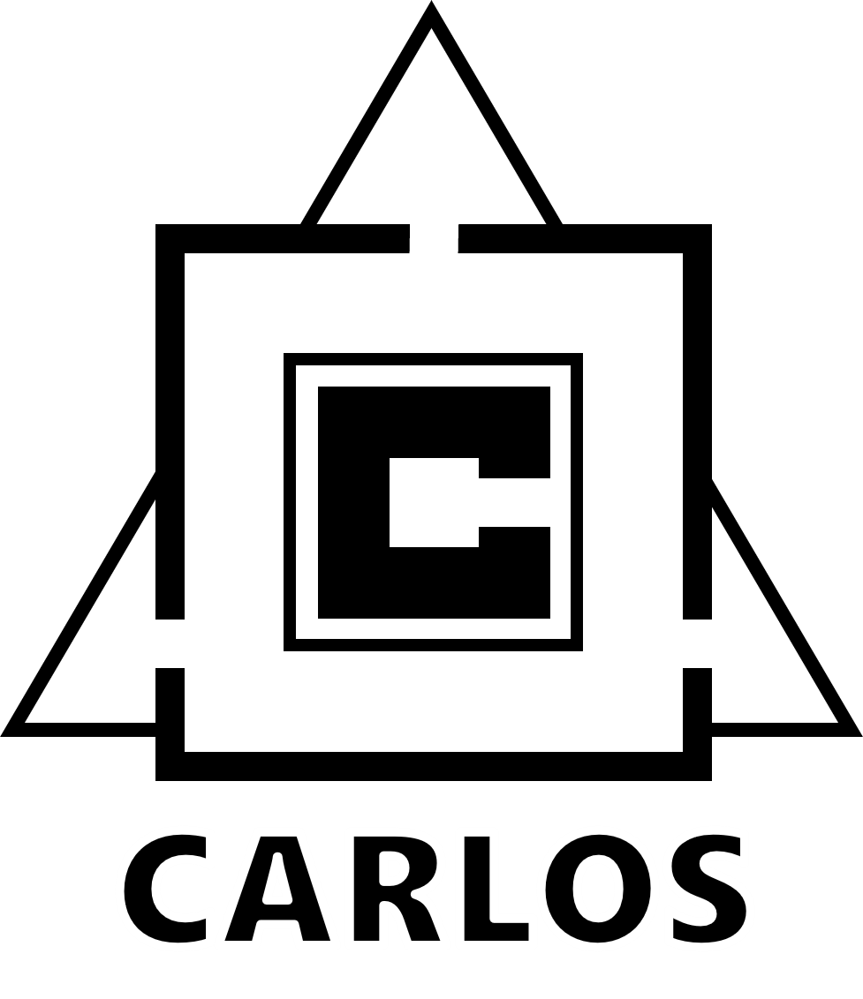

# **CARLOS** - An Open, Modular, and Scalable Simulation Architecture for the Development and Testing of Automated Vehicles

This repository contains the official reference implementation of our open, modular and scalable simulation architecture. It provides a containerized simulation framework based on the open-source simulator CARLA and enables simple integration of custom ROS applications. We provide useful examples for the three use cases as presented in our [paper](TODO):
- [Software Prototyping](./software-prototyping/)
- [Data-Driven Development](./data-driven-development/)
- [Automated Testing](./automated-testing/)

> [!IMPORTANT]  
> This repository is open-sourced and maintained by the [**Institute for Automotive Engineering (ika) at RWTH Aachen University**](https://www.ika.rwth-aachen.de/).  
> **Simulation, Containerization and DevOps for Automated Driving** are some of many research topics within our [*Vehicle Intelligence & Automated Driving*](https://www.ika.rwth-aachen.de/en/competences/fields-of-research/vehicle-intelligence-automated-driving.html) domain.  
> If you would like to learn more about how we can support your DevOps or automated driving efforts, feel free to reach out to us!  
> &nbsp;&nbsp;&nbsp;&nbsp; *Timo Woopen - Manager Research Area Vehicle Intelligence & Automated Driving*  
> &nbsp;&nbsp;&nbsp;&nbsp; *+49 241 80 23549*  
> &nbsp;&nbsp;&nbsp;&nbsp; *timo.woopen@ika.rwth-aachen.de*

The repository is structured as follows:
- [**CARLOS** - An Open, Modular, and Scalable Simulation Architecture for the Development and Testing of Automated Vehicles](#carlos---an-open-modular-and-scalable-simulation-architecture-for-the-development-and-testing-of-automated-vehicles)
  - [Publication](#publication)
  - [Getting Started](#getting-started)
  - [Simulation Architecture](#simulation-architecture)
    - [Simulation Core: ***carla-simulator***](#simulation-core-carla-simulator)
    - [Communication Actor: ***carla-ros-bridge***](#communication-actor-carla-ros-bridge)
    - [Control Actor: ***carla-scenario-runner***](#control-actor-carla-scenario-runner)
  - [Acknowledgements](#acknowledgements)

## Publication

> **CARLOS: An Open, Modular, and Scalable Simulation Architecture for the Development and Testing of Automated Driving Systems**  
> ([*arXiv*](TODO))
>
> [Christian Geller](https://www.ika.rwth-aachen.de/de/institut/team/fahrzeugintelligenz-automatisiertes-fahren/geller.html), [Benedikt Haas](TODO), [Amarin Kloeker](https://www.ika.rwth-aachen.de/en/institute/team/vehicle-intelligence-automated-driving/kloeker-amarin.html), [Jona Hermens](TODO), [Bastian Lampe](https://www.ika.rwth-aachen.de/en/institute/team/vehicle-intelligence-automated-driving/lampe.html), [Lutz Eckstein](https://www.ika.rwth-aachen.de/en/institute/team/univ-prof-dr-ing-lutz-eckstein.html)
> [Institute for Automotive Engineering (ika), RWTH Aachen University](https://www.ika.rwth-aachen.de/en/)
> 
> <sup>*Abstract* – Future mobility systems and their components are increasingly defined by their software. The complexity of these systems and the ever-changing requirements posed at the software require continuous software updates. The dynamic nature of the system and the practically innumerable scenarios in which different software components work together necessitate efficient and automated development and testing procedures that use simulations as one core methodology. The availability of such simulation architectures is a common interest among many stakeholders, especially in the field of automated driving. That is why we propose CARLOS - an open, modular, and scalable simulation framework for the development and testing of automated driving systems that leverages the rich CARLA and ROS ecosystems. We provide core building blocks for this framework and explain how it can be used and extended by the community. Its architecture builds upon modern microservice and DevOps principles such as containerization and continuous integration. In our paper, we motivate the architecture by describing important design principles and showcasing three major use cases  - software prototyping, data-driven development, and automated testing. We make CARLOS and example implementations of the use cases available at GitHub: [https://github.com/ika-rwthaachen/carlos](https://github.com/ika-rwthaachen/carlos).</sup>

---

## Getting Started

**Note:** Check out the [requirements](./utils/requirements.md) and the comprehensive [tutorial](./utils/tutorial.md), which gives an overview of the main simulation framework features, combining CARLA and ROS in a containerized composition.

This repository provides demonstrations which can be used as example or initial starting point. A specific demo can be started using the provided script:

```bash
./run-demo.sh software-prototyping
```

After you are done, hitting <kbd>CTRL</kbd> + <kbd>C</kbd> twice is enough because the provided `run-demo.sh` does the entire cleanup.

| Use Case | Integrated Components | Description |
| ------ | ------                | ------ 
| [***software-prototyping***](./software-prototyping/README.md) | carla-simulator, carla-ros-bridge, rviz | Transfers simulation data into the ROS ecosystem. |
| [***data-driven-development***](./data-driven-development/README.md) | carla-simulator, carla-ros-bridge, carla-scenario-runner | Automated simulation configuration to capture sensor data at large scale. |
| [***automated-testing***](./automated-testing/README.md) | carla-simulator, carla-scenario-runner | Sequential simulation of multiple scenarios in OpenSCENARIO format with automated evaluation. |

## Simulation Architecture


Our architecture consists of several *sub-layers*, that encapsulate different components with aligned purposes:
- **Simulation layer** - simulator combined with additional interfaces and capabilities;
- **Storage layer** - persistent data used for or generated by the simulation layer;
- **Application layer** - software/users interacting with the simulation layer to achieve certain goals.

Focusing on the simulation layer, it is composed of *sub-layers*, namely the simulator layer housing the core that performs the simulation work, the interface layer containing protocols for interaction with the simulator, and the control layer which includes a set of actors that extend the functionalities of the core. Letting each instance of the simulation have its own set of components inside of these *sub-layers* improves customizability and flexibility, as it allows users to tailor it to their concrete use cases. 

In following a microservice approach by separating the simulation layer into different components, we increase modularity, and thus gain the earlier discussed benefits like better maintainability. 
This is especially true if said components are containerized, which opens up the architecture to common orchestration tools and vastly simplifies a distributed simulation. The architecture captures this by including an *{orchestration layer* with an orchestrator that dynamically manages all other layers.

CARLOS is a framework that implements this architecture to enhance CARLA as a simulator core and that has proven itself during extensive usage in our research and work. Some additional components within the rich CARLA ecosystem are crucial to our framework and available as specified GitHub forks. We extended those repository by additional GitHub CI workflows to generate minimal Docker images used within the provided use case examples.

### Simulation Core: [***carla-simulator***](https://github.com/ika-rwth-aachen/carla-simulator)
<p align="left">
  </a>
  
  <a href="https://github.com/ika-rwth-aachen/carla-simulator/actions/workflows/docker.yml"></a>
  
  
  
</p>
The carla-simulator constitutes the central element of the framework and handles all graphical and dynamic calculations in the individual simulation time steps. Within our GitHub repository, we extend the pre-existing Dockerfiles to create enhanced Ubuntu-based container images of CARLA via novel CI pipelines.

### Communication Actor: [***carla-ros-bridge***](https://github.com/ika-rwth-aachen/carla-ros-bridge)
<p align="left">
  </a>
  
  <a href="https://github.com/ika-rwth-aachen/carla-ros-bridge/actions/workflows/docker.yml"></a>
    
  
  
</p>
The carla-ros-bridge is the component that facilitates the powerful combination of CARLA and ROS. It retrieves data from the simulation to publish it over ROS topics while simultaneously listening on different topics for requested actions, which are translated to commands to be executed in CARLA. It does this by using both the ROS communication standard DDS, as well as RPC via the CARLA Python API, in tandem, effectively bridging the two. Here, [docker-ros](https://github.com/ika-rwth-aachen/docker-ros) enables a continual building of container images with recent versions of ROS, Python, and Ubuntu.

### Control Actor: [***carla-scenario-runner***](https://github.com/ika-rwth-aachen/carla-scenario-runner)
<p align="left">
  
  
  <a href="https://github.com/ika-rwth-aachen/carla-scenario-runner/actions/workflows/docker.yml"></a>
  
  
  
</p>
To enable scenario-based testing and evaluation, the carla-scenario-runner is used. It is a powerful engine that follows the OpenSCENARIO standard for scenario definitions. An additional ROS service allows other ROS nodes to dynamically issue the execution of a specified scenario using the mentioned Scenario Runner. For the creation of more modern and light-weight container images, a custom Dockerfile was written, which is published alongside this paper.


> [!NOTE]
> For all of our use case examples we will be utilizing predefined Docker services, listed in [carla-components.yml](./utils/components.yml) and further described in the [carla-components overview](./utils/components.md).

## Citation
We hope that our simulation framework CARLOS can help your research. If this is the case, please cite it using the following metadata.
```
@inproceedings{CARLOS24,
author = {Geller, Christian and Haas, Benedikt and Kloeker, Amarin and Hermens, Jona and Lampe, Bastian and Eckstein, Lutz},
title = {{CARLOS: An Open, Modular, and Scalable Simulation Architecture for the Development and Testing of Automated Driving Systems}},
url = {https://github.com/ika-rwth-aachen/carlos},
year = {2024}
}
```

## Acknowledgements

This research is accomplished within the project [AUTOtech.*agil*](https://www.ika.rwth-aachen.de/en/competences/projects/automated-driving/autotech-agil-en.html) (FKZ 01IS22088A). We acknowledge the financial support for the project by the Federal Ministry of Education and Research of Germany (BMBF).
