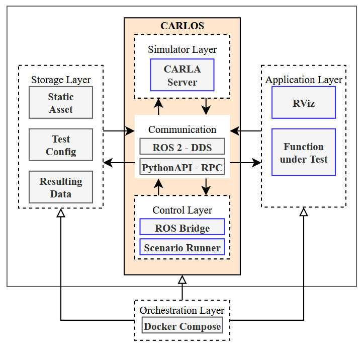

# **CARLOS** - An Open, Modular, and Scalable Simulation Framework for the Development and Testing of Software for C-ITS

This repository contains CARLOS, the official reference implementation of the open, modular and scalable simulation architecture presented in our [paper](TODO). We provide a containerized simulation framework based on the open-source simulator [CARLA](http://carla.org/) and enable a simple integration of custom ROS applications. Find below a brief description of the architecture as well as configurations and instructions for demos of three example use cases:
- [Software Prototyping](./software-prototyping/)
- [Data-Driven Development](./data-driven-development/)
- [Automated Testing](./automated-testing/)

## Notice

> [!IMPORTANT]  
> This repository is open-sourced and maintained by the [**Institute for Automotive Engineering (ika) at RWTH Aachen University**](https://www.ika.rwth-aachen.de/).  
> **Simulation, Containerization and DevOps for Automated Driving** are some of many research topics within our [*Vehicle Intelligence & Automated Driving*](https://www.ika.rwth-aachen.de/en/competences/fields-of-research/vehicle-intelligence-automated-driving.html) domain.  
> If you would like to learn more about how we can support your DevOps or automated driving efforts, feel free to reach out to us!  
> &nbsp;&nbsp;&nbsp;&nbsp; *Timo Woopen - Manager Research Area Vehicle Intelligence & Automated Driving*  
> &nbsp;&nbsp;&nbsp;&nbsp; *+49 241 80 23549*  
> &nbsp;&nbsp;&nbsp;&nbsp; *timo.woopen@ika.rwth-aachen.de*

## Content


- [**CARLOS** - An Open, Modular, and Scalable Simulation Framework for the Development and Testing of Software for C-ITS](#carlos---an-open-modular-and-scalable-simulation-framework-for-the-development-and-testing-of-software-for-c-its)
  - [Publication](#publication)
  - [Quick Start](#quick-start)
  - [Use Cases](#use-cases)
  - [Simulation Architecture](#simulation-architecture)
  - [Citation](#citation)
  - [Acknowledgements](#acknowledgements)


## Publication

> **CARLOS: An Open, Modular, and Scalable Simulation Framework for the Development and Testing of Software for C-ITS**  
> > *([arXiv](http://arxiv.org/abs/2404.01836), [ResearchGate](https://www.researchgate.net/publication/379484629_CARLOS_An_Open_Modular_and_Scalable_Simulation_Framework_for_the_Development_and_Testing_of_Software_for_C-ITS))*  
>
> [Christian Geller](https://www.ika.rwth-aachen.de/de/institut/team/fahrzeugintelligenz-automatisiertes-fahren/geller.html), [Benedikt Haas](https://github.com/BenediktHaas96), [Amarin Kloeker](https://www.ika.rwth-aachen.de/en/institute/team/vehicle-intelligence-automated-driving/kloeker-amarin.html), [Jona Hermens](TODO), [Bastian Lampe](https://www.ika.rwth-aachen.de/en/institute/team/vehicle-intelligence-automated-driving/lampe.html), [Lutz Eckstein](https://www.ika.rwth-aachen.de/en/institute/team/univ-prof-dr-ing-lutz-eckstein.html)
> [Institute for Automotive Engineering (ika), RWTH Aachen University](https://www.ika.rwth-aachen.de/en/)
> 
> <sup>*Abstract* – Future mobility systems and their components are increasingly defined by their software. The complexity of these cooperative intelligent transport systems (C-ITS)  and the ever-changing requirements posed at the software require continual software updates. The dynamic nature of the system and the practically innumerable scenarios in which different software components work together necessitate efficient and automated development and testing procedures that use simulations as one core methodology. The availability of such simulation architectures is a common interest among many stakeholders, especially in the field of automated driving. That is why we propose CARLOS - an open, modular, and scalable simulation framework for the development and testing of software in C-ITS that leverages the rich CARLA and ROS ecosystems. We provide core building blocks for this framework and explain how it can be used and extended by the community. Its architecture builds upon modern microservice and DevOps principles such as containerization and continuous integration. In our paper, we motivate the architecture by describing important design principles and showcasing three major use cases - software prototyping, data-driven development, and automated testing. We make CARLOS and example implementations of the three use cases publicly available at [https://github.com/ika-rwth-aachen/carlos](https://github.com/ika-rwth-aachen/carlos).</sup>

---

## Quick Start

> [!TIP]
> Make sure your computer fulfills the [requirements](./utils/requirements.md) and feel free to first check out our comprehensive [tutorial](./utils/tutorial/README.md), which gives an overview of our simulation framework's main features, and describes how CARLA and ROS applications can be combined in a containerized composition.

This repository provides demos for different use cases. The demos can be used as an example or initial starting point for your own variations for the use cases. A specific demo can be started using the provided [run-demo.sh](./run-demo.sh) script, for example:

```bash
./run-demo.sh software-prototyping
```

Hitting <kbd>CTRL</kbd> + <kbd>C</kbd> twice stops a demo.

## Use Cases

Each link below provides a detailed description of a provided use case and instructions on how to adjust it to your needs.

| Use Case | Integrated Components | Description |
| ------ | ------                | ------ 
| [***software-prototyping***](./software-prototyping/README.md) | carla-simulator, carla-ros-bridge, rviz | Transfers simulation data into the ROS ecosystem. |
| [***data-driven-development***](./data-driven-development/README.md) | carla-simulator, carla-ros-bridge, carla-scenario-runner | Automated simulation configuration to capture sensor data at large scale. |
| [***automated-testing***](./automated-testing/README.md) | carla-simulator, carla-scenario-runner | Sequential simulation of multiple scenarios in OpenSCENARIO format with automated evaluation. |

## Simulation Architecture



Our architecture consists of several *sub-layers* encapsulating different components that serve individual purposes:

- **Simulation Layer** - simulation core equipped with low-level interfaces and capabilities;
- **Control Layer** - tools for interactions with the simulation core;
- **Application Layer** - software interacting with the simulation layer to achieve certain goals;
- **Storage Layer** - persistent data used for or generated by the simulation layer;
- **Orchestation Layer** - automated configuring, coordinating, and managing of all other layers.

The *simulation layer* contains the core of a simulation software. It performs the simulation work via its graphics and physics engine, and manages the world state. It comes with low-level interfaces that are often specific to the used software. The *control layer* provides tools for interactions with the simulation core via preferably standardized interfaces and communication protocols. The *application layer* contains application-specific user iterfaces and user-defined functions interacting with the simulation. These computational layers are accompanied by the *storage layer* which can both provide data to the other layers or record data generated by the other layers during simulation. Last, the *orchestration layer* automates the configuring, coordinating, and managing of the other layers.

The various layers are composed into a microservice architecture, fostering scalability, flexibility, reusability, maintainability. We achieve this through a very modular approach in which all major components are containerized.

CARLOS is a framework that implements the described architecture. We make use of already established software, especially the [CARLA simulator](http://carla.org//). Some additional components from the rich CARLA ecosystem are crucial to our framework and available as specified GitHub forks. We extended these repositories by additional GitHub CI workflows to generate Docker images built with [docker-ros](https://github.com/ika-rwth-aachen/docker-ros). This approach enables an automatic and continual building of up-to-date container images with recent versions of, e.g., ROS, Python, and Ubuntu.

### Simulation Core: [***carla-simulator***](https://github.com/ika-rwth-aachen/carla-simulator)
<p align="left">
  </a>
  
  <a href="https://github.com/ika-rwth-aachen/carla-simulator/actions/workflows/docker.yml"></a>
  
  
  
  
</p>
The carla-simulator constitutes the central element of the framework and handles all graphics and physics calculations in the individual simulation time steps.

### Communication Actor: [***carla-ros-bridge***](https://github.com/ika-rwth-aachen/carla-ros-bridge)
<p align="left">
  </a>
  
  <a href="https://github.com/ika-rwth-aachen/carla-ros-bridge/actions/workflows/docker.yml"></a>
  
  
  
  
</p>

The carla-ros-bridge is the component that facilitates the powerful combination of CARLA and ROS. It retrieves data from the simulation to publish it on ROS topics while simultaneously listening on different topics for requested actions, which are translated to commands to be executed in CARLA. It communicates via DDS to interact with ROS, and via RPC to interact with the CARLA Python API.

### Control Actor: [***carla-scenario-runner***](https://github.com/ika-rwth-aachen/carla-scenario-runner)
<p align="left">
  
  
  <a href="https://github.com/ika-rwth-aachen/carla-scenario-runner/actions/workflows/docker.yml"></a>
  
  
  
  
</p>

To enable scenario-based testing and evaluation, the carla-scenario-runner is used. It is a powerful engine that follows the [OpenSCENARIO standard](https://www.asam.net/standards/detail/openscenario-xml/) for scenario definitions. An additional ROS service allows other ROS nodes to dynamically issue the execution of a specified scenario using the carla-scenario-runner. For the creation of light-weight container images, a custom Dockerfile is used.


> [!NOTE]
> For all provided use case examples we use predefined Docker services, listed in [carla-components.yml](./utils/components.yml) and further described in the [carla-components overview](./utils/components.md).

## Citation
We hope that our simulation framework CARLOS can help your research. If this is the case, please cite it using the following metadata.
```
@inproceedings{CARLOS24,
author = {Geller, Christian and Haas, Benedikt and Kloeker, Amarin and Hermens, Jona and Lampe, Bastian and Eckstein, Lutz},
title = {{CARLOS: An Open, Modular, and Scalable Simulation Framework for the Development and Testing of Software for C-ITS}},
url = {http://arxiv.org/abs/2404.01836},
year = {2024}
}
```

## Acknowledgements

This research is accomplished within the project [AUTOtech.*agil*](https://www.ika.rwth-aachen.de/en/competences/projects/automated-driving/autotech-agil-en.html) (FKZ 01IS22088A). We acknowledge the financial support for the project by the Federal Ministry of Education and Research of Germany (BMBF).
