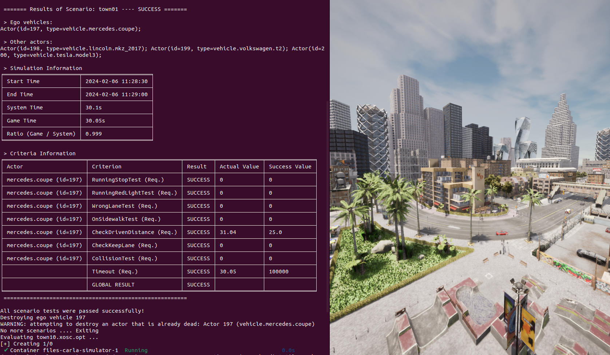
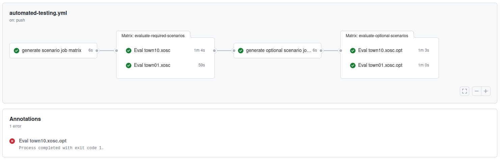

# Use Case: *Automated testing*

>[!NOTE]
> **Background**: In the *automated testing* demo, simulation is considered to systematically evaluate a large number of defined tests, potentially within the safety assurance process. A specific test configuration may encompass both a concrete scenario and well-defined test metrics for evaluation. Thus, a direct interface to a standardized scenario database is favorable, and custom pass-fail criteria need to be configurable to deduce objective test results. Scalability drastically improves efficiency when simulating multiple test configurations. Moreover, embedding the simulation architecture in a CI process further accelerates the entire safety assurance.

The subsequent demonstration showcases *automated testing* and specifically addresses the following requirements:
- predefined scenario metrics and **automatic evaluation**
- automation and **scalability**
- CI integration with **GitHub actions and workflows**

## Getting Started

> [!IMPORTANT]  
> Make sure that all [system requirements](../utils/requirements.md) are fulfilled.
> Additionally, the CI related part of this demo requires a [self-hosted GitHub Runner](https://docs.github.com/en/actions/hosting-your-own-runners/managing-self-hosted-runners/about-self-hosted-runners) to execute scenarios within a [GitHub workflow](https://docs.github.com/en/actions/using-workflows/about-workflows). The specific requirements for such a runner are listed [below](#self-hosted-github-runner).

This demo aims to automatically evaluate predefined test scenarios. For this purpose, a test catalog can be defined using OpenSCENARIO files as contained in the [scenarios](../utils/scenarios) folder. These scenarios can be simulated and evaluated using the [carla-scenario-runner](https://github.com/ika-rwth-aachen/carla-scenario-runner). Thus, a basic [docker-compose template](../.github/actions/evaluate-scenario/files/template.yml) only includes the `carla-simulator` and a `carla-scenario-runner` Docker service. So, in general, the demo enables the efficient execution of multiple scenario-based tests with CARLA, both in local environments and within an automated GitHub CI process.

### Manual Testing Pipeline

In your local environment, you can evaluate multiple scenarios directly, using the provided [run-demo.sh](../run-demo.sh) script:

```bash
# carlos$
./run-demo.sh automated-testing
```
This executes the [evaluate-scenarios.sh](./evaluate-scenarios.sh) script with default settings. You can also run this script directly and provide custom overrides to the default values by using specific environment variables, flags and arguments. For a detailed overview, please check the script or run:
```bash
# carlos/automated-testing$
./evaluate-scenarios.sh -h
```
The script sequentially evaluates all scenario files in the selected folder. After each scenario run, a detailed evaluation based on the criteria specified in the scenario is presented. An example is shown below.

<p align="center"></p>


### Automated CI Pipeline

All scenarios within the test catalog are also simulated and evaluated in an automated [CI pipeline on GitHub](https://github.com/ika-rwth-aachen/carlos/actions/workflows/automated-testing.yml). A detailed look in the [scenarios folder](../utils/scenarios/) shows that some of them have the postfix `.opt` , marking them as optional. This means a failure in test evaluation is allowed for those specific scenarios and does not determine the success of the entire pipeline. The CI pipeline processes required scenarios first, followed by all optional scenarios. In both cases a job matrix is dynamically created based on the found scenarios, in which each job targets and evaluates a specific scenario. As an example, a workflow is shown below.

<p align="center"></p>

>[!NOTE]
> Even though the complete pipeline appears to have succeeded, the annotations show that one of the optional scenarios has failed and thus should still be investigated

#### Actions

We provide two [GitHub actions](../.github/actions/) for CARLOS:
  - [generate-job-matrix](../.github/actions/generate-job-matrix/)
  - [evaluate-scenario](../.github/actions/evaluate-scenario/)

They can be used within a GitHub CI workflow to create a job list of simulation runs, and consecutively run all simulations. A demonstration of this is presented next.

#### Workflow

The workflow presented in [automated-testing.yml](../.github/workflows/automated-testing.yml) combines the different actions and performs simulation evaluation  analog to the local `evaluation-scenarios.sh`. It leverages the modularity and customizability of the provided actions by reusing them and configuring them differently. For example, the `generate-job-matrix` allows customizing the `query-string`, which is used for matching and collecting fitting scenarios as a job matrix for following pipeline steps.

#### Self-Hosted GitHub Runner

As mentioned before, a [self-hosted GitHub Runner](https://docs.github.com/en/actions/hosting-your-own-runners/managing-self-hosted-runners/about-self-hosted-runners) needs to be set up in order to run the described CI pipeline in your custom repository fork. Apart from ensuring the [system requirements](../utils/requirements.md), the runner currently also needs to be started in a **local session** (i.e. not via SSH, RPD or other tools) and has to have access to the primary "display" (see [X window system](https://en.wikipedia.org/wiki/X_Window_System)). You can validate this by running the following command in the same session where you want to start the runner:
```bash
echo $DISPLAY
```
The result should be something simple like `:1` . If there is anything in front of the colon, the session is most likely not local and thus not suitable for this setup.

### Setup Your Own Simulation Testing Pipeline

Follow these steps to setup your own simulation testing pipeline:
1. [Fork](https://docs.github.com/de/pull-requests/collaborating-with-pull-requests/working-with-forks/fork-a-repo) the CARLOS repository on GitHub.
2. Add a self-hosted runner using the provided information [above](#self-hosted-github-runner).
3. Push additional OpenSCENARIO test files in the [scenarios](../utils/scenarios/) folder.
4. Observe the GitHub workflow and scenario test evaluations.

You may now update the specific test metrics to enable comprehensive testing. In addition, custom ITS functions can be used to control the vehicle instead of the basic CARLA autopilot, enabling useful testing.


## Outlook - Scalability using Orchestration Tools

The principles and workflows demonstrated here already show the effectiveness of automating the simulation processes. Certainly, a much higher grade of automation can be achieved by incorporating more sophisticated orchestration tools like [Kubernetes](https://kubernetes.io/docs/concepts/overview/), [Docker Swarm](https://docs.docker.com/engine/swarm/) or others. These tools allow for better scalability, while also simplifying the deployment and monitoring of the services.
