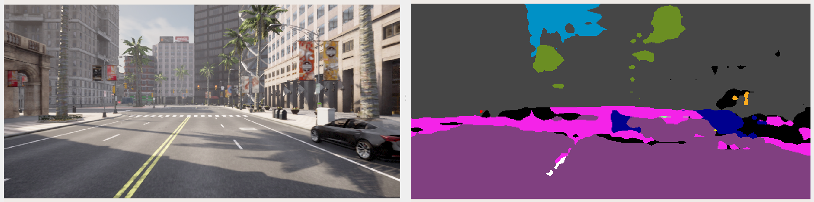

# Use Case: *Software Prototyping*

>[!NOTE]
> **Background**: The *software prototyping* use case addresses the initial development phase of an automated driving function, where developers aim for simple and quick experimenting. It focuses on the flawless integrability of the component under test and ensures general operability within the overall system. An early integration facilitates interface harmonization, which is particularly important when assembling modules from different entities. In many cases, a single example scenario is sufficient to carry out initial tests. However, high simulation fidelity is required in many cases, which implies realistic simulation conditions, ranging from realistic environments to accurate sensor, vehicle, or driver models.

The subsequent demonstration showcases rapid *software prototyping* and specifically addresses the following requirements:
- high simulation **fidelity**
- comprehensive **data availability** in customizable data formats
- **Robot Operating System** communication interfaces
- modular **containerization** and flexible integration of custom modules

## Getting Started

> [!IMPORTANT]  
> Make sure that all [system requirements](../utils/requirements.md) are fulfilled.

Directly start the use case demonstration using the top-level `run-demo.sh` script:

```bash
./run-demo.sh software-prototyping
```

This example demonstrates a basic CARLA simulation in tandem with the widely used Robot Operations System ([ROS](https://www.ros.org/)).(Due to future developments towards ROS 2, we are only covering ROS 2 within this demo.) In addition to a CARLA simulation core, a ROS bridge enables communication between CARLA and ROS by translating simulation outputs (e.g. sensor data) to ROS topics. In addition, RViz is used as a visualization component.

Specifically, there are three main components contained in the `software-prototyping` demo:
- carla-simulator
- carla-ros-bridge
- ros-monitoring

> [!NOTE]
> A detailed description of the individual components can be found in [components guide](../utils/components.md).

### Quick Start
After starting the `software-prototyping` demo a CARLA GUI opens up where you can look around using <kbd>W</kbd><kbd>A</kbd><kbd>S</kbd><kbd>D</kbd>, holding the left or right mousebutton and moving the mouse in the desired direction. 

After a short initialization phase, a second RViz window visualizes a variety of sensor raw data avilable in ROS. Multiple RGB cameras, a depth and semantic camera, as well as a lidar sensor are attached to a vehicle, covering the enviroment in rich detail. 

The vehicle itself is controlled using the official [carla_ad_agent](https://github.com/carla-simulator/ros-bridge/tree/master/carla_ad_agent) package. However, you can also override the controls using the manual control PyGame window. After hitting <kbd>B</kbd> the manual transmission mode is enabled and allows to drive the vehicle using <kbd>W</kbd><kbd>A</kbd><kbd>S</kbd><kbd>D</kbd>.


<p align="center"></p>

### Integration of Custom Software Components
As described above, this demo should emphasize a simple integration of novel, developed software components. Hence, we integrate a new component, an image segmentation perception function. Following modularization and containerization within CARLOS, the integration of a novel component only includes a new entry within the Docker Compose file:
```bash
image-segmentation:
    image: rwthika/carlos-image-segmentation
    command: ros2 launch image_segmentation image_segmentation_launch.py image_topic:=/carla/ego_vehicle/rgb_front/image
```


Here, we use the public available Docker image of our [image segmentation ROS 2 package on DockerHub](https://hub.docker.com/r/rwthika/carlos-image-segmentation). Using [docker-ros](https://github.com/ika-rwth-aachen/docker-ros) enables a simple generation of Docker images for custom ROS packages and thus, a straighforward integration into the simulation framework CARLOS. 

However, we have to make sure that the ROS node subscribes an available topic with correct message type. Here, we use the [sensor_msgs/Image](https://github.com/ros/common_msgs/blob/noetic-devel/sensor_msgs/msg/Image.msg) topic of a simulated front-facing RGB camera attached the ego vehicle. As an output, the image segmentation provides an additional [sensor_msgs/Image](https://github.com/ros/common_msgs/blob/noetic-devel/sensor_msgs/msg/Image.msg) topic which can be visualized within RViz.

<p align="center"></p>

> [!NOTE]
> The provided image segmentation only uses a small and simplified model, so the results are not really satisfying. However, this example shows a simple integration of a custom function within our simulation framework CARLOS.

Feel free to play around with RViz or change the provided example according to your needs. You can also integrate your own function within this simulation setup. 

When you are done, go back to the terminal and hit <kbd>CTRL</kbd>+<kbd>C</kbd> twice so the Compose setup and its container stops. This automatically clean up the stopped container and restrict access to the X server again.