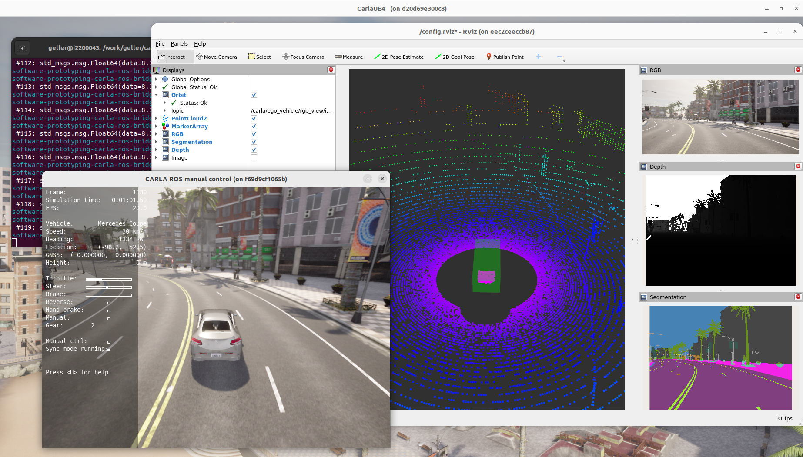

# Use Case *Software Prototyping*


>[!NOTE]
> **Background**: The *software prototyping* use case addresses the initial development phase of an automated driving function, where developers aim for simple and quick experimenting. It focuses on the flawless integrability of the component under test and ensures general operability within the overall system. An early integration facilitates interface harmonization, which is particularly important when assembling modules from different entities. In many cases, a single example scenario is sufficient to carry out initial tests. However, high simulation fidelity is required in many cases, which implies realistic simulation conditions, ranging from realistic environments to accurate sensor, vehicle, or driver models.

The subsequent demonstration showcases the *software prototyping* usecase and emphasizes that all derived requirements are fulfilled:
- high simulation **fidelity**
- comprehensive **data availability** in customizable data formats
- **Robot Operating System** communication interfaces
- modular **containerization** and flexible integration of custom modules

## Getting Started

> [!IMPORTANT]  
> Make sure that all [system requirements](../utils/requirements.md) are fulfilled.

Directly start the use case demonstration using the top-level `run-demo.sh` script:

```bash
./run-demo.sh software-prototyping
```

