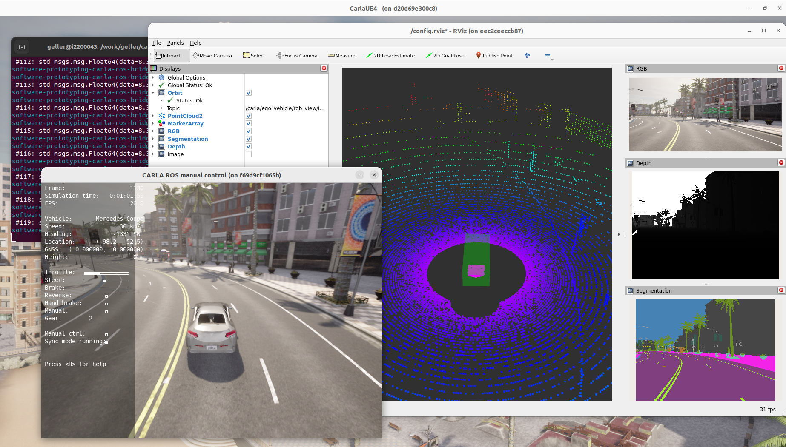
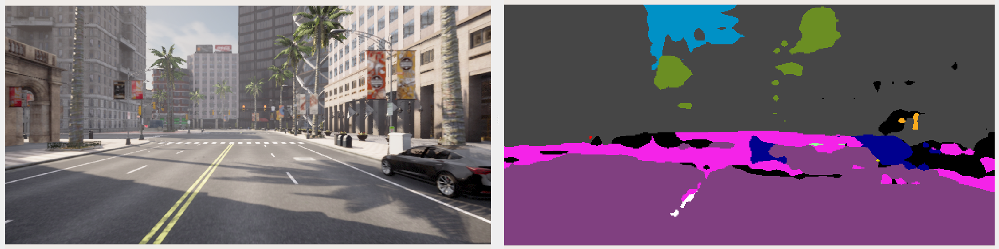

# Use Case: *Software Prototyping*

>[!NOTE]
> **Background**: The *software prototyping* use case addresses the initial development phase of an automated driving function, where developers aim for simple and quick experimenting. It focuses on the flawless integrability of the component under test and assesses the general operability within the overall system. An early integration of different modules facilitates the harmonization of interfaces, which is particularly important when combining modules from different development teams. In many cases, a single example scenario is sufficient to carry out these initial tests. However, all necessary data must already be provided. For many applications, this data may include sensor data such as camera images and lidar point clouds, which is why a high fidelity simulation software such as CARLA may already be needed. 

The subsequent demonstration showcases *software prototyping* and specifically addresses the following requirements:
- Availability of **comprehensive simulation data** in customizable data formats.
- Ability to easily attach custom **Robot Operating System** (ROS)-based functions to the simulation and its provided data.
- Isolation of custom ROS functions and the simulation software through **containerization**.

## Getting Started

> [!IMPORTANT]  
> Make sure that all [system requirements](../utils/requirements.md) are fulfilled.

Directly start the use case demonstration using the top-level `run-demo.sh` script:

```bash
./run-demo.sh software-prototyping
```

This example demonstrates a basic CARLA simulation in tandem with the widely used Robot Operations System ([ROS](https://www.ros.org/)). We only cover ROS 2 with this demo. In addition to a CARLA simulation core, a ROS bridge enables communication between CARLA and ROS by translating simulation outputs (e.g. sensor data) to ROS topics. In addition, RViz is used as a visualization component.

Specifically, there are three main components used in the `software-prototyping` demo:
- [carla-simulator](https://github.com/ika-rwth-aachen/carla-simulator)
- [carla-ros-bridge](https://github.com/ika-rwth-aachen/carla-ros-bridge)
- [ros-monitoring](https://github.com/ika-rwth-aachen/carlos/blob/main/utils/components.md#ros-monitoring)
- A containerized image segmentation ROS node that serves as an example on how to attached a custom function to the simulation.

> [!NOTE]
> A detailed description of the individual components can be found in [components guide](../utils/components.md).

### Quick Start
After starting the `software-prototyping` demo, a CARLA GUI opens up where you can look around using <kbd>W</kbd><kbd>A</kbd><kbd>S</kbd><kbd>D</kbd>, holding the left or right mouse button and moving the mouse in the desired direction. 

After a short initialization phase, a second window shows up with RViz and a variety of raw sensor data available in ROS. Multiple RGB cameras, a depth and semantic camera, as well as a lidar sensor are attached to a vehicle, visualizing the environment in rich detail. 

The vehicle itself is controlled by the official [carla_ad_agent](https://github.com/carla-simulator/ros-bridge/tree/master/carla_ad_agent) package. However, you can also override the controls using the manual control PyGame window. After hitting <kbd>B</kbd> the manual transmission mode is enabled and allows you to drive the vehicle using <kbd>W</kbd><kbd>A</kbd><kbd>S</kbd><kbd>D</kbd>.


<p align="center"></p>

### Integration of Custom Software Components
As described above, we demonstrate how a developed software prototype can be easily integrated into the overall framework. Specifically, we use a very basic image segmentation function as an example that we attach to the simulation to compute segmented images from the images of a RGB camera. If you have a containerized ROS node available, its integration is as easy as a new entry in this demo's [Docker Compose file](docker-compose.yml):
```bash
image-segmentation:
    image: rwthika/carlos-image-segmentation
    command: ros2 launch image_segmentation image_segmentation_launch.py image_topic:=/carla/ego_vehicle/rgb_front/image
```

We have already included this entry in the provided file. The image segmentation node is integrated into our publicly available Docker Container: [Image segmentation ROS 2 package on DockerHub](https://hub.docker.com/r/rwthika/carlos-image-segmentation). It listens to the [sensor_msgs/Image](https://github.com/ros/common_msgs/blob/noetic-devel/sensor_msgs/msg/Image.msg) topic of a simulated front-facing RGB camera attached to the ego vehicle. As output, the node provides a topic with segmented images of type [sensor_msgs/Image](https://github.com/ros/common_msgs/blob/noetic-devel/sensor_msgs/msg/Image.msg) which is visualized in RViz. Note that the provided image segmentation function uses a small and simplified model that does not perform very well. This is intended here, because we only want to use it to demonstrate the integration of some function.

<p align="center"></p>


### Interacting with the Containers

Follow these steps to interact with the running containers:

1. Install [docker-run](https://github.com/ika-rwth-aachen/docker-run). This will, e.g., simplify successfully running GUI applications in the containers compared to regular `docker run` or `docker exec`.
2. List all running containers on your host with `docker ps`.
3. Attach to a running container with `docker-run --name <container-name>`, e.g., `docker-run software-prototyping-carla-ros-bridge-1`.
4. Example: To list all available ROS topics, in a container where ROS 2 is installed, run `ros2 topic list`.

### Integrating Your Own Function

Follow these steps to integrate your own function(s):
1. Write some ROS node prototype that you would like to attach to the simulation.
2. Make sure your ROS node listens to one of the available ROS topics.
3. Containerize the ROS node, e.g., with our tool [docker-ros](https://github.com/ika-rwth-aachen/docker-ros).
4. Integrate the container image as a service into our provided [Docker Compose file](docker-compose.yml#L35) as described above.
5. Run `./run-demo.sh software-prototyping` again.
6. Configure RViz such that the output of your custom ROS node is visualized.
7. Hit <kbd>CTRL</kbd>+<kbd>C</kbd> twice to stop the demo.

You may now iterate on the development of your software prototype until you are satisfied with how it integrates with the simulation and with potential further software modules that you may also integrate. Then, you may proceed with a possible next step in the software development life cycle, [data-driven development](../data-driven-development/README.md).