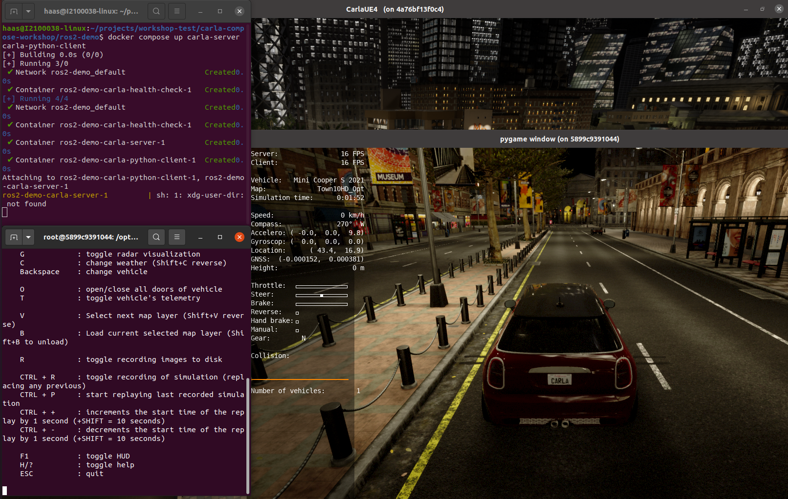
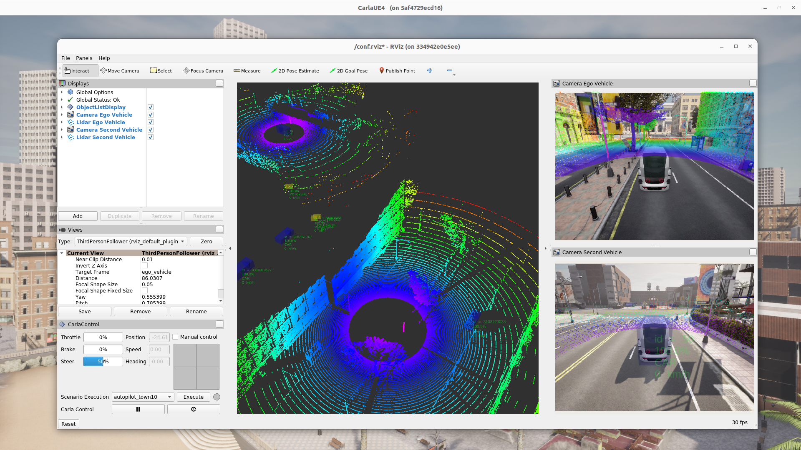
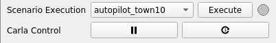
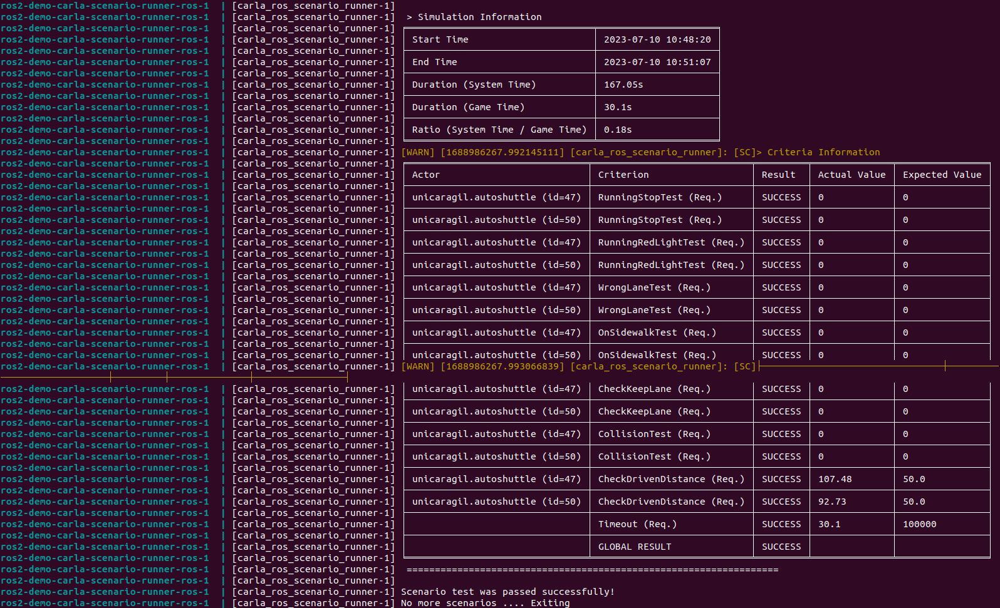
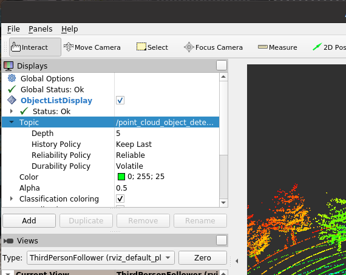
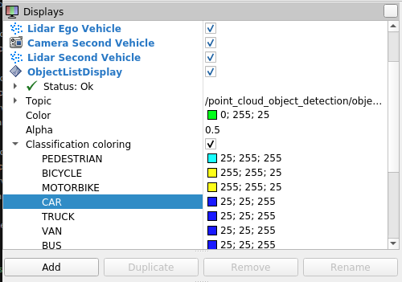
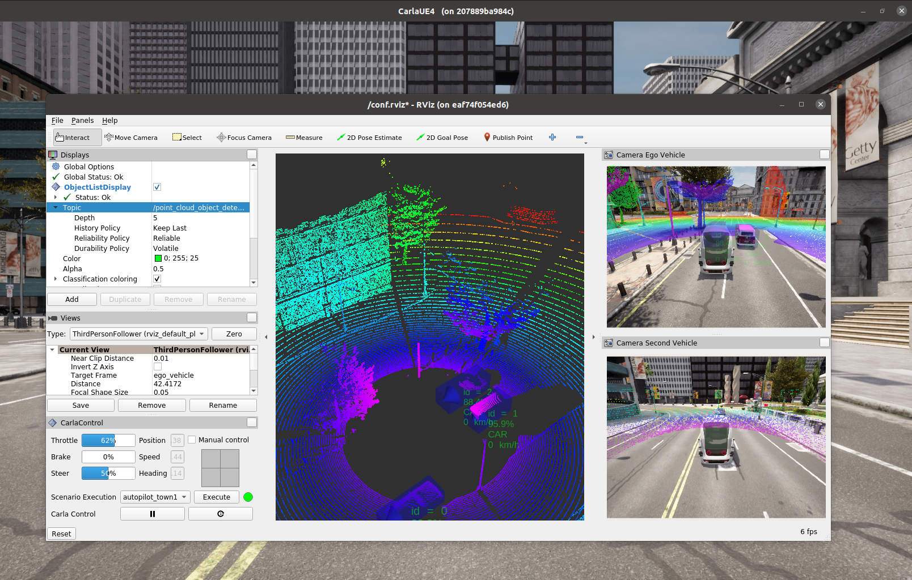

# Tutorial: Simulative Development and Testing with CARLA and ROS

> **Note**: This repository provides a comprehensive and containerized simulation framework based on the open-source [CARLA simulator](https://github.com/carla-compose/carla-simulator). This framework can be used to develop and test C-ITS functions in a closed-loop simulation environment. Have a closer look at the [README](../README.md) to get a first overview of the provided demo use cases.


---

## Setup

### Requirements

The core requirements for using and testing the simulation framework are listed below:
- [Ubuntu 20.04 LTS Focal](https://ubuntu.com/download/desktop) (or higher) with `sudo` permission
- enough hard disk storage, which depends on the workshop and use-case (~50 GB are recommended)
- NVIDIA GPU (at least 8 GB GPU memory are recommended)

Make sure to install all prerequisites and that GUI access is available. 
- [Nvidia Driver](https://ubuntu.com/server/docs/nvidia-drivers-installation)(validate installation with `nvidia-smi`)
- Docker Installation
    - [Docker](https://www.digitalocean.com/community/tutorials/how-to-install-and-use-docker-on-ubuntu-22-04)
    - [Docker Compose](https://www.digitalocean.com/community/tutorials/how-to-install-and-use-docker-compose-on-ubuntu-22-04)
    - [Nvidia Docker](https://github.com/NVIDIA/nvidia-docker)


Make sure that your machine has access to its X server to enable graphical output.
```bash
xhost +local:
```

### Creating a Compose file

The backbone of the proposed simulation framework is based on Docker Compose, enabling modular plugging of different Docker services. All described [components](./components.md) can be integrated in a [`docker-compose.yml`](../agile-development/docker-compose.yml) file.

```yml
# you can utilize yaml features to avoid repeating yourself and centralizing configurations
x-sensors-mount: &sensors-mount         ./sensors.json:/sensors.json
x-rviz-config-mount: &rviz-config-mount ./config.rviz:/config.rviz

# ==============================================================================

services:

  # starts a CARLA simulator instance named 'carla-simulator' with a GUI window 
  carla-simulator:
    extends:
      file: ../utils/components.yml
      service: carla-simulator

  # starts the carla-ros-bridge
  carla-ros-bridge:
    extends:
      file: ../utils/components.yml
      service: carla-ros-bridge
    # wait with startup until carla-server is available
    depends_on:
      carla-simulator:
        condition: service_healthy
    volumes:
      # you can mount custom launch files...
      - ./carla-ros-bridge.launch.py:/demo.launch.py
      - *sensors-mount
    # ...and then execute them. Note the -ic flag for an interactive bash!
    # Without an interactive bash, many important env vars wouldn't be working or even set
    command: bash -ic "ros2 launch /demo.launch.py"

  # starts rviz with a GUI window
  ros-monitoring:
    extends:
      file: ../utils/components.yml
      service: ros-monitoring
    depends_on:
      carla-simulator:
        condition: service_healthy
    volumes:
      # you can mount custom rviz configs...
      - *rviz-config-mount
    # ...and then use them when starting up rviz with the -d flag
    command: bash -ic 'rviz2 -d /conf.rviz &> /dev/null'
```

This aggregated `docker-compose.yml` file enables direct integration into the [ROS 2](https://docs.ros.org/en/rolling/index.html) world.


As a preliminary step, pull all Docker images used in this demo. This could take some time, so it's recommended to pull all images in advance.

```bash
# optionally pull all specified service images in advance
docker compose pull
```

## Part 1: Getting Started

### Running the Compose setup

### CARLA server + Python API

The [CARLA simulator](https://github.com/carla-simulator/carla) is a powerful open-source simulation tool based on the Unreal Engine. It uses a server-client architecture providing APIs for Python, C++ and ROS applications.

In the first example, we are starting a CARLA server and its GUI along with a Python API client. Both processes are running in dedicated Docker containers and are launched via Docker Compose. Detailed information about Docker Compose are given in the [compose basics guide](../docs/compose-basics.md).

```bash
# launch compose setup including carla-server and carla-python-client
docker compose up carla-server carla-python-client
```

This should bring up a CARLA server running a map called [Town 10](https://carla.readthedocs.io/en/latest/map_town10/). You can look around by using <kbd>W</kbd><kbd>A</kbd><kbd>S</kbd><kbd>D</kbd>, holding the left or right mousebutton and moving the mouse in the desired direction.

In a second terminal, run `docker ps` which shows a second container named `ros2-demo-carla-python-client-1`.
We can use the tool [docker-run](https://github.com/ika-rwth-aachen/docker-run) CLI for direct interaction with this client container:

If not already installed, you can install `docker-run` directly with pip:
```bash
# install docker-run-cli with docker-ros plugin
pip install docker-run-cli[docker-ros]
```

Check if `docker-run` can already be used:
```bash
docker-run --version
```

If this prints a version, you are good to go. If not (it may tell you `docker-run: command not found`), you can most likely fix it like so:
```bash
echo "export PATH=$HOME/.local/bin:$PATH" >> ~/.bashrc
source ~/.bashrc
```

Now, use `docker-run` to directly attach to the running `carla-python-client` container:
```bash
# attach to the carla-python-client container
docker-run --name ros2-demo-carla-python-client-1
```

Inside of the container, we can interact with the `carla-server` container and the CARLA world respectively:

```bash
# changes weather settings dynamically
./examples/dynamic_weather.py --host carla-server
```

The first example script changes the weather settings of the CARLA server dynamically. It's a simle example for an interaction between the server and a Python client. The process can be stopped using <kbd>CTRL</kbd>+<kbd>C</kbd>.


In the following second example, we are spawning a vehicle and attaching a controller to it. Run

```bash
./examples/manual_control.py --host carla-server --sync
```
Following these steps, you should be seeing something like this:

[<p align="center">](./images/manual-control.png)

You now have direct control over the vehicle using the <kbd>W</kbd><kbd>A</kbd><kbd>S</kbd><kbd>D</kbd> keys. The manual control process can be stopped again with <kbd>CTRL</kbd>+<kbd>C</kbd>.

The entire compose setup including all running `ros2-demo` containers can be stopped with <kbd>CTRL</kbd>+<kbd>C</kbd> in the first terminal and removed with
```bash
# stops all specified services and removes their containers completely
docker compose down
```

### CARLA server + ROS 2

After observing the CARLA server, we add some additional Docker Compose services to bridge information into the ROS 2 world.

The following command launches all defined services from the [ros2-demo/docker-compose.yml](../ros2-demo/docker-compose.yml) file. In addition to the previous containers, it launches a `carla-ros-bridge`, `carla-scenario-runner-ros`, `carla-its-converter` and `ros-monitoring` container. A comprehensive overview about all available Docker services can be found in the [carla components guide](./carla-components.md).

```bash
# launch all services defined in docker-compose.yml
docker compose up
```

This starts a CARLA server and an `rviz` window. The `carla-ros-bridge` container spawns two *autoSHUTTLE*s at random positions with camera and LiDAR sensor. All sensor data is published as `ROS 2` topic. In addition, the `ros-monitoring` container visualizes all sensor data, as well as the global object list in `its message` definition. The translation into this specialized format is part of the dedicated `carla-its-converter` container.

Check out the `rviz` setup to get familiar with the simulation setup and all available `ROS 2` topics. You should be seeing something like this:

[<p align="center">](./images/rviz-overview.png)

To simulate a specific scenario, the [autopilot_town10.xosc](../assets/autopilot_town10.xosc) OpenSCENARIO file is used within this demo. It can be launched directly from the CARLA `rviz` panel and executes the scenario inside the `carla-scenario-runner-ros` service. The rviz panel is located on the bottom left and looks like this:

[<p align="center">](./images/rviz-scenario-selection.png)

Besides vehicle control of the two main vehicles, additional challenging traffic is spawned. The simulation can be stopped at any time using the `Play`/`Pause` buttons within the CARLA `rviz` panel.

The scenario has a predefined duration after which a comprehensive evaluation of the scenario is printed, based on the stop trigger conditions in the OpenSCENARIO file. The output should look something like this:

[<p align="center">](./images/scenario-runner-output.png)

> **Note**: After finishing the scenario, the challenging traffic as well as the vehicle controllers of the two main *autoSHUTTLE*s are removed. This leads to an uncontrolled vehicle movement of the two *autoSHUTTLE*s and could lead to crashes.

The entire compose setup including all running `ros2-demo` containers can be stopped with <kbd>CTRL</kbd>+<kbd>C</kbd> and removed with
```bash
# stops all specified services and removes their containers completely
docker compose down
```

## Part 2: ITS Function Integration

In the second part of this workshop a custom C-ITS ROS 2 function should be integrated as a new service. As an example, a perception module for object detection on point clouds is considered. For a straight-forward integration of this module, it needs to fulfill some requirements:
- deployed as micro-service using `docker-ros`;
- integrated in a ROS node;
- use common and standardized ROS messages.


Integrating a new ITS function can be accomplished by adding the following service definition in [`docker-compose.yml`](../ros2-demo/docker-compose.yml):

```bash
point-cloud-object-detection:
    extends:
        file: ../docker-components.yml
        service: gpu-service
    image: gitlab.ika.rwth-aachen.de:5050/autotech/its-modules/perception/point_cloud_object_detection:latest
    command: ros2 launch point_cloud_object_detection point_cloud_object_detection.launch.py point_cloud_topic:="/carla/ego_vehicle/lidar" startup_state:=3
```
- **`point-cloud-object-detection`** is the service name resulting in a new container named `ros2-demo-point-cloud-object-detection-1`
- service is extended from a predefined **`gpu-service`** which enables access to an available NVIDIA GPU
- container **`image`** is directly taken from the GitLab registry of the `point_cloud_object_detection` repository
- although each run image already has a predefined **`command`**, it is overridden to set additional launch file arguments:
    - **`point_cloud_topic`** defines the input ROS topic and is set to the point cloud of the ego_vehicle, published by the `carla-ros-bridge`
    - **`start_up_state`** defines the ROS 2 lifecycle state that should be reached when starting the node

The setup can be launched again from the `ros2-demo` folder:

```bash
# launch all services defined in docker-compose.yml
docker compose up
```

The new `point-cloud-object-detection` service continuously logs its state and the amount of detected objects. 

Using `rviz` gives the opportunity to visualize the detected boxes as ROS 2 message. The existing `ObjectListDisplay` currently visualizes the ground truth coming from the `/carla_its_converter/objects` topic. Change the targeted topic by double-clicking the old topic name and replace it with `/point_cloud_object_detection/object_list`:

[<p align="center">](./images/rviz-change-topic.png)

You can change the color settings of the new added `ObjectListDisplay` to better distinguish the detected objects from the visualized sensor data:

[<p align="center">](./images/rviz-change-color.png)


After that the new ITS function is fully integrated and visualized. The configuration should look like: 

[<p align="center">](./images/rviz-with-pcod.png)

When done testing, the entire compose setup is stopped by hitting <kbd>CTRL</kbd>+<kbd>C</kbd> in the terminal, then:
```bash
# stops all specified services and removes their containers completely
docker compose down

# restricts X server access again
xhost -local:
```
