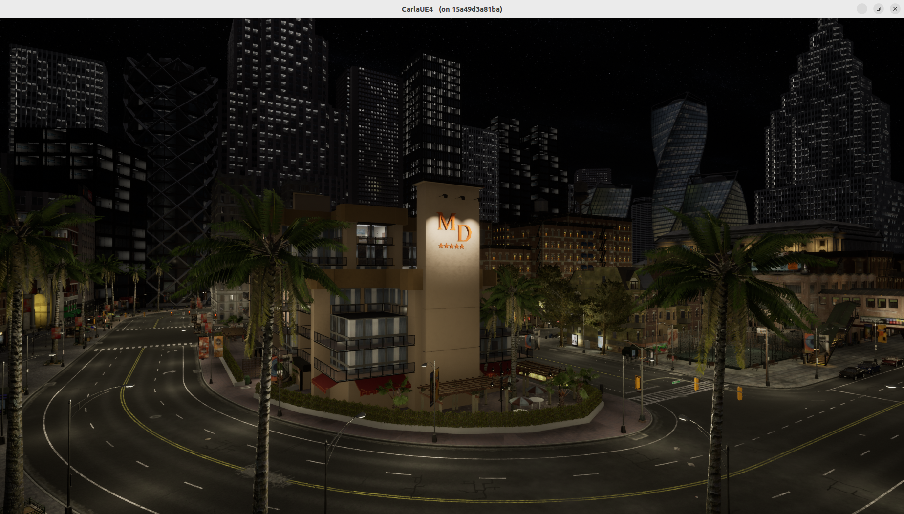
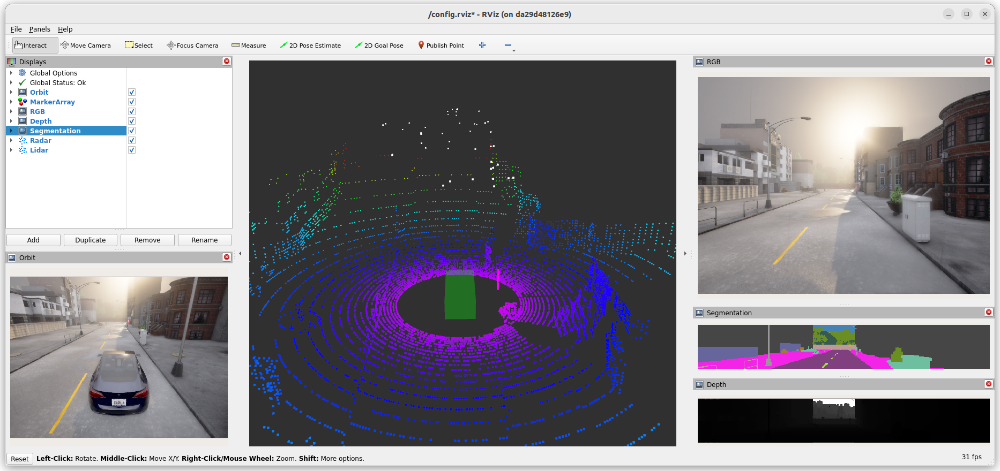
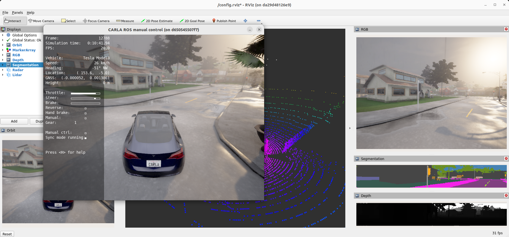

# Tutorial: Simulative Development and Testing with CARLA and ROS

> [!NOTE]
> This repository provides CARLOS, an open, modular and scalable simulation framework based on the open-source [CARLA simulator](https://github.com/ika-rwth-aachen/carla-simulator). The framework can be used to develop and test C-ITS software in a closed-loop simulation environment. Have a closer look at the top-level [README](../README.md) to get a first overview of the provided demo use cases.

---

## Setup

### Requirements

The core requirements for using and testing the simulation framework are provided within the [requirements guide](./requirements.md).

### Creating a Compose File

The backbone of the proposed simulation framework is based on Docker Compose, enabling modular plugging of different Docker services. All described [components](../components.md) can be integrated in a custom Docker Compose file. Feel free to set up your own custom [`docker-compose.yml`](./docker-compose.yml) within the directory of this tutorial:

```yml
# you can utilize yaml features to avoid repeating yourself and centralizing configurations
x-rviz-config-mount: &rviz-config-mount ./config.rviz:/config.rviz

# ==============================================================================

services:

  # starts a CARLA simulator instance named 'carla-simulator' with a GUI window 
  carla-simulator:
    extends:
      file: ../components.yml
      service: carla-simulator
  
  # starts a client instance named 'carla-client' to connect with CARLA via PythonAPI
  carla-client:
    extends:
      file: ../components.yml
      service: carla-client
    depends_on:
      carla-simulator:
        condition: service_healthy
    command: sleep infinity

  # starts the carla-ros-bridge
  carla-ros-bridge:
    extends:
      file: ../components.yml
      service: carla-ros-bridge
    depends_on:
      carla-simulator:
        condition: service_healthy
    # ...and then execute them. Note the -ic flag for an interactive bash!
    # Without an interactive bash, many important env vars wouldn't be working or even set
    command: bash -ic 'ros2 launch carla_ros_bridge carla_ros_bridge_with_example_ego_vehicle.launch.py host:=carla-simulator'
    # .. note that the host name is explictly set to the name of the carla-simulator Docker service!

  # starts rviz with a GUI window named 'ros-monitoring'
  ros-monitoring:
    extends:
      file: ../components.yml
      service: ros-monitoring
    depends_on:
      carla-simulator:
        condition: service_healthy
    volumes:
      # you can mount custom rviz configs...
      - *rviz-config-mount
    # ...and then use them when starting up rviz with the -d flag
    command: bash -ic 'rviz2 -d /config.rviz --ros-args -p use_sim_time:=true &> /dev/null'
```

This aggregated `docker-compose.yml` file enables direct integration of CARLA into the [ROS 2](https://docs.ros.org/en/rolling/index.html) ecosystem.

As a preliminary step, pull all Docker images used in this tutorial. This could take some time, so it's recommended to pull all images in advance.

```bash
# optionally pull all specified service images in advance
docker compose pull
```

## Running the Compose Setup

### CARLA Server + Client

The [CARLA simulator](https://github.com/carla-simulator/carla) is a powerful open-source simulation tool based on Unreal Engine. It uses a server-client architecture providing APIs for Python, C++ and ROS applications.

In the first example, we are starting a CARLA serveralong with a Python API client. The two processes are running in dedicated containers which can be launched via Docker Compose. Detailed information about Docker Compose can be found in the official [documentation](https://docs.docker.com/compose/).

> [!IMPORTANT]
> Make sure that your machine has access to its X server to enable graphical output.
> ```bash
> xhost +local:
> ```

Then, you can launch the two containers using the `docker compose up` command:
```bash
# launch compose setup including carla-simulator and carla-client
docker compose up carla-simulator carla-client
```

This should bring up a CARLA server GUI running a map called [Town 10](https://carla.readthedocs.io/en/latest/map_town10/). You can look around by using <kbd>W</kbd><kbd>A</kbd><kbd>S</kbd><kbd>D</kbd>, holding the left or right mousebutton and moving the mouse in the desired direction.

In a second terminal, run `docker ps` which shows all containers, one of them named `tutorial-carla-client-1`.
We can use the tool [docker-run](https://github.com/ika-rwth-aachen/docker-run) CLI for direct interaction with this container:

If not already installed, you can install `docker-run` directly with pip:
```bash
# install docker-run-cli with docker-ros plugin
pip install docker-run-cli[docker-ros]
```

Check if `docker-run` can already be used:
```bash
docker-run --version
```

If this prints a version, you are good to go. If not (it may tell you `docker-run: command not found`), you can most likely fix it like so:
```bash
echo "export PATH=$HOME/.local/bin:$PATH" >> ~/.bashrc
source ~/.bashrc
```

> [!NOTE]
> You can also use `docker exec -it` to interact with the running container using the standard Docker CLI. Nevertheless, we highly recommend to use the useful features of [docker-run](https://github.com/ika-rwth-aachen/docker-run).


Now, use `docker-run` to directly attach to the running `carla-client` container:
```bash
# attach to the carla-client container
docker-run --name tutorial-carla-client-1
```

Inside of the container, we can interact with the `carla-simulator` container:

```bash
# changes weather settings dynamically
./examples/dynamic_weather.py --host carla-simulator
```
[<p align="center">](../images/tutorial-dynamic-weather.png)

This example script changes the weather settings of the CARLA server dynamically. It's a simple example for an interaction between the CARLA server and a Python client communicating over two separate Docker containers. The processes can be stopped using <kbd>CTRL</kbd>+<kbd>C</kbd>.

The running `carla-simulator` and `carla-client` containers can be stopped by terminating the Docker Compose setup with <kbd>CTRL</kbd>+<kbd>C</kbd> in the first terminal. In addition, remove the stopped containers with
```bash
# stops all specified services and removes their containers completely
docker compose down
```

### CARLA Server + ROS 2

After observing the CARLA server, we investigate some additional Docker Compose services to bridge information into the ROS 2 world.

The following command launches all defined services from  `docker-compose.yml` file. In addition to the previous container, it launches a `carla-ros-bridge`, and a `ros-monitoring` container. A comprehensive overview about all available Docker services can be found in the [components guide](./components.md).

```bash
# launch all services defined in docker-compose.yml
docker compose up
```

This mainly starts a CARLA server GUI and an `rviz` window. The `carla-ros-bridge` container an ego vehicle at a random positions with various sensors, including RGB, depth and segmentation cameras, but also lidar and radar sensors. All sensor data is published as `ROS 2` topic and is visualized using RViz in the `ros-monitoring` container.

Check out the `rviz` setup to get familiar with the simulation setup and all available `ROS 2` topics. You should be seeing something like this:

[<p align="center">](../images/tutorial-rviz-overview.png)

> [!TIP]
> Feel free to observe the available topics within `rviz` or change the [sensors.json](../software-prototyping/sensors.json) file within the container to customize additional sensors.

Within this tutorial, the `carla-ros-bridge` container offers another GUI, enabling direct control of the ego vehicle in the simulation. A PyGame window allows to drive the vehicle around with the <kbd>W</kbd><kbd>A</kbd><kbd>S</kbd><kbd>D</kbd> keys or toggling the autopilot with <kbd>P</kbd>. While driving around, have a look in RViz to capture the generated sensor data. The setup should look similar to this:

[<p align="center">](../images/tutorial-pygame.png)


The entire Docker Compose setup including all running containers can be stopped with <kbd>CTRL</kbd>+<kbd>C</kbd> and removed with
```bash
# stops all specified services and removes their containers completely
docker compose down

# restricts X server access again
xhost -local:
```
